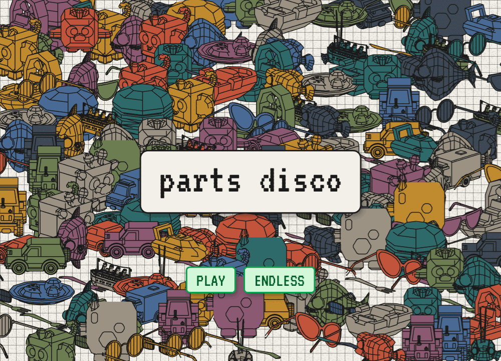

# parts disco

**A yard full of look-alikes — cars, or fish, or boats, or more. Find the one you were shown.**

## ▶ [PLAY IT NOW](https://kleer001.github.io/parts_disco/)

Runs in your browser. Nothing to install, nothing to launch.

## What it is

A yard fills with one kind of thing — cars, or fish, or boats, or glasses, or food, or
little animals — drawn as outlines and painted so that no two touching shapes share a
colour. A panel shows you one of them, solid, at an angle you will not find in the yard.
Click every copy.

The catch is the set. Four of its twelve are the same shape underneath: with cars it is a
sedan, a sports sedan, a taxi and a police car, alike but for a roof sign — and every set
has its own four near-twins. So the work is never seeing the things. It is telling them
apart.

Sixteen yards, and they tighten. Each is one of six sets — cars, fish, boats, glasses,
food, animals — and the set turns over from yard to yard, never running into itself twice
in a row. The first yard gives you ten big shapes that look nothing like each other. The
last gives you a hundred and twenty small ones, four near-identical twins, and one colour
to paint them all.

## Finding one

The screens below are one set's round; the others play the same.

A thing you find grows, shakes, flashes green, and settles into a colour it was not
wearing before. That colour is the only record you get. Miss, and the counter goes red.

Find them all and the losers clear off, leaving yours flashing on a whitening yard.

## Where it is

A prototype. It plays end to end, and nobody but its author has played it. If you get
to the sixteenth yard, or quit before it,
[say which](https://github.com/kleer001/parts_disco/issues).

---

Models by [Kenney](https://kenney.nl) (Car, Food, Watercraft and Cube Pets kits),
iPoly3D (Glasses Pack) and Quaternius (Cute Fish), all public domain (CC0). Set in
[VT323](https://fonts.google.com/specimen/VT323). MIT licensed.

Vanilla JavaScript, no build step. [How it works](ARCHITECTURE.md), and
[why it works that way](DECISIONS.md).
</content>
