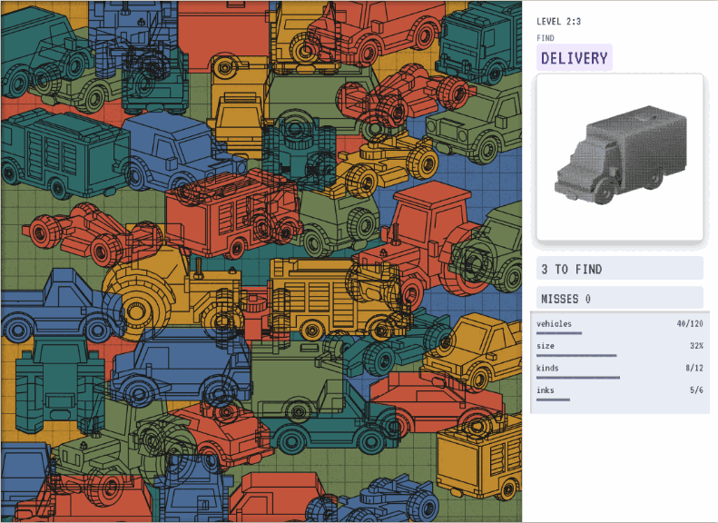
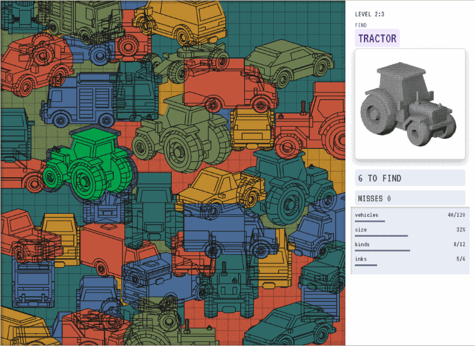
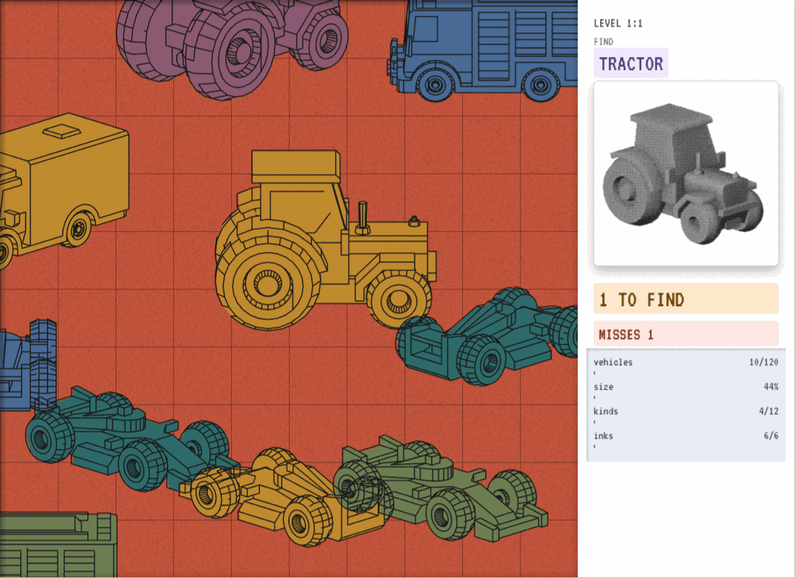
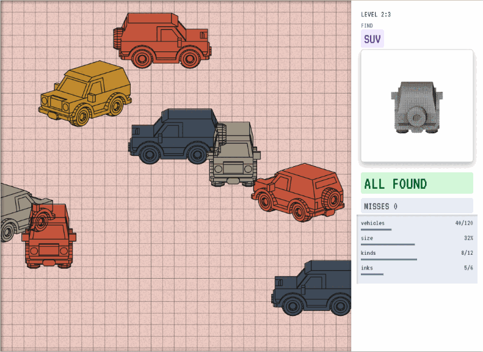
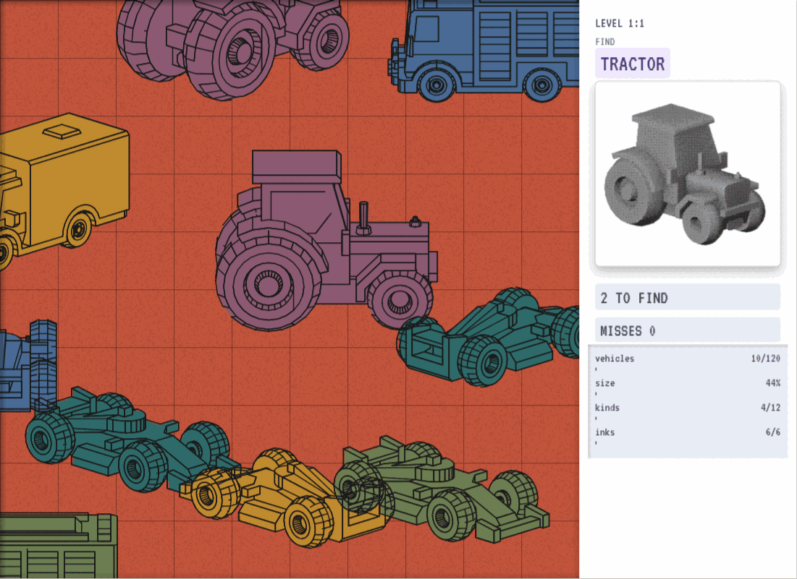

# parts disco

**A yard full of vehicles. Find the one you were shown.**

### [▶ Play it in your browser](https://kleer001.github.io/parts_disco/)

No install, no sign-up. It loads the fleet once, then runs.



## What it is

Vehicles are strewn across a yard, drawn as outlines and painted so that no two
touching shapes share a colour. A panel shows you one of them, solid, at an angle
you will not find in the yard. Click every copy of it.

The catch is the fleet. Four of the twelve are the same car underneath: a sedan, a
sports sedan, a taxi and a police car. Head-on, the only thing between them is a roof
sign. So the work is never seeing the vehicles. It is telling them apart.

Sixteen yards. The first gives you ten big vehicles that look nothing like each other.
The last gives you a hundred and twenty small ones, four near-identical cars, and one
colour to paint them all.

## Finding one

A vehicle you find grows, shakes, flashes green, and settles into a colour it was not
wearing before. That colour is the record — from then on the board itself shows what
you have done.



Miss, and the counter goes red. Get down to one left, and the panel turns amber.



Find them all and the losers clear off, leaving the ones you found flashing on a
whitening yard.



## What makes a yard hard

Four dials, and the panel shows every one of them against its range.

| | |
|---|---|
| **which vehicles** | The strongest by a distance. A tractor is found instantly however many cars surround it; a taxi is hard on an empty board. |
| **how many** | Ten at the start, a hundred and twenty at the end. More to look at, and more burying each other. |
| **how big** | Smaller is harder twice over — less of the detail that tells two shells apart, and more of them fitting on the yard. |
| **how many colours** | Five is enough for every two touching shapes to differ. Below that they start sharing, and a vehicle starts to merge into whatever it is lying on. |



## Running it yourself

No build step and no dependencies. Clone it and serve the folder.

```sh
./run.sh          # serves http://localhost:8000
./run.sh 9000     # pick a port; it scans upward if that one is busy
npm test          # node --test, no framework
```

Open the address it prints. Do not double-click `index.html` — ES modules, `fetch`
and relative paths all behave differently under `file://`.

## Under the hood

Vanilla JavaScript, ES modules, one canvas, no libraries. Every draw comes from a
seeded generator, so a board reproduces exactly from its seed.

- [`ARCHITECTURE.md`](ARCHITECTURE.md) — how the board is dealt, coloured and drawn.
- [`dev/README.md`](dev/README.md) — the bench, where the game's look was tuned with
  every knob on a slider.
- [`DECISIONS.md`](DECISIONS.md) — what was ruled, and what was rejected.

Raised in [Trace ROM Studio](https://github.com/kleer001/trace_rom_studio).

## Credits

- The vehicles are Kenney's [Car Kit](https://kenney.nl/assets/car-kit), released
  into the public domain under CC0.
- The panel is set in [VT323](https://fonts.google.com/specimen/VT323) by Peter Hull,
  under the SIL Open Font License.
- The game is MIT. See [`LICENSE`](LICENSE).

## Where it is

A prototype. It plays end to end, and nobody but its author has played it.

Three things are still open. Should the yard drift rather than hold still? Does the
difficulty climb at the right rate? And are the near-twins a good puzzle, or an
unfair one?

Found a yard that felt wrong? [Open an issue](https://github.com/kleer001/parts_disco/issues).
